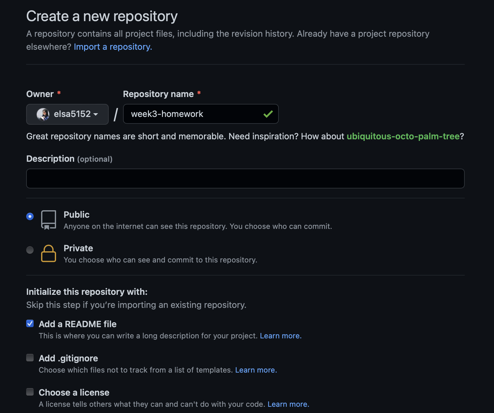

# week3-homework

This is the detail for week3-homework.

* Create a new repository on my Github account and creat a README.md file.

* Clone all the file form Gitlab to my Github account.
* Write Javascript code in vs Code.

* Write the code in vs Code and upload it by gitpush.

* Update to the repo
* Create a webpage link

## Link my homework

[Lernantino]( https://elsa5152.github.io/week2-homework/)