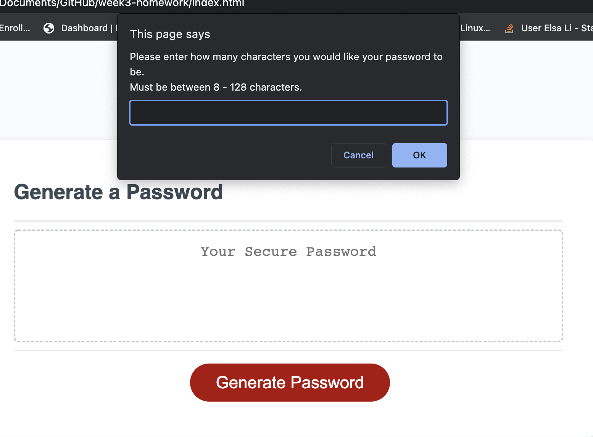
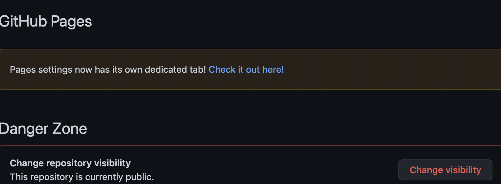

# week3-homework

This is the detail for week3-homework.

* Create a new repository on my Github account and creat a README.md file.

* Clone all the file form Gitlab to my Github account.
* Write Javascript code in vs Code.
* Make sure the code meets the requirements.
* Always checking the result in webpage.

* Write the code in vs Code and upload it by gitpush.
* Update to the repo
* Create a webpage link at github in setting

## Link my homework

[Password Generator]( https://elsa5152.github.io/week3-homework/)